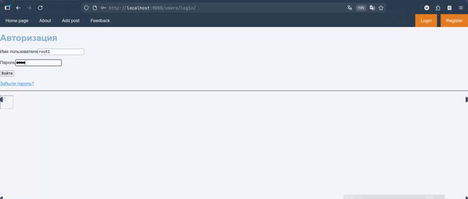

# SiteAuto (Django + Docker)


## Features
- Dockerized local development (Django runserver, PostgreSQL, Adminer)
- Custom User model with email-based authentication (EmailAuthBackend)
- GitHub OAuth via social-auth-app-django
- Captcha with django-simple-captcha
- Django Debug Toolbar integration
- Redis-backed cache configuration
- Media and static handling for development (served by runserver)
- Template pagination and responsive images
- Admin customization (headers, titles)
- Context processor for auto categories (users.context_processors.get_auto_category)
- Fixture loading example (`siteauto/db.json`)
- Environment-based configuration (DEBUG, ALLOWED_HOSTS, secrets via .env)
- Unit-tests
- Custom admin-panel
- Editable posts
- Read posts

Training project built with Django, Docker Compose, PostgreSQL, Adminer, GitHub OAuth, Debug Toolbar, and Captcha.

## GIF
<!-- Place your demo GIF below (example path). Replace with your own. -->


## Contents
- Quick Start
- Environment (.env)
- Run with Docker
- Migrations & Data
- GitHub OAuth
- Dev Tips
- Common Issues
- Production Notes

## Quick Start
1. Install Docker and Docker Compose.
2. Create a `.env` file in the project root.
3. Build and start:
   - `docker compose up --build`
4. Apply migrations:
   - `docker compose exec siteauto python manage.py migrate`
5. Create a superuser:
   - `docker compose exec siteauto python manage.py createsuperuser`
6. Open http://localhost:8000/

## Environment (.env)
Recommended keys (do not commit):
```
DJANGO_SECRET_KEY=your-secret
DJANGO_DEBUG=1
ALLOWED_HOSTS=127.0.0.1 localhost 0.0.0.0

DB_NAME=yourdb
DB_USER=youruser
DB_PASSWORD=yourpass
DB_HOST=postgres
DB_PORT=5432

EMAIL_HOST_USER=your@gmail.com
EMAIL_HOST_PASSWORD=your-app-password

SOCIAL_AUTH_GITHUB_KEY=github-client-id
SOCIAL_AUTH_GITHUB_SECRET=github-client-secret
```
Add `.env` to `.gitignore` before pushing.

## Run with Docker
- Uses Django’s built-in server for development:
  ```
  python manage.py runserver 0.0.0.0:8000
  ```
- Services:
  - `postgres` — database
  - `adminer` — DB client (http://localhost:8080)
  - `siteauto` — Django app

Code is mounted into the container; changes apply immediately.

## Migrations & Data
- Migrate:
  ```
  docker compose exec siteauto python manage.py migrate
  ```
- Create superuser:
  ```
  docker compose exec siteauto python manage.py createsuperuser
  ```
- Load fixtures:
  ```
  docker compose exec siteauto python manage.py loaddata siteauto/db.json
  ```

## GitHub OAuth
Set up a GitHub OAuth App:
1. GitHub → Settings → Developer settings → OAuth Apps.
2. Create or open your app.
3. Use:
   - Homepage URL: `http://localhost:8000/`
   - Authorization callback URL: `http://localhost:8000/social-auth/complete/github/`
4. Put Client ID/Secret in `.env`:
   - `SOCIAL_AUTH_GITHUB_KEY`
   - `SOCIAL_AUTH_GITHUB_SECRET`

Note: Use direct image URLs when needed (avatars.githubusercontent.com or raw.githubusercontent.com). `github.com/.../blob/...` does not serve images directly.

## Dev Tips
- Debug: `DEBUG=True` and `django-debug-toolbar` enabled.
- Media: served automatically with `DEBUG=True`.
- Static: place files under `siteauto/static` and use `` in templates.

## Common Issues
- Fixture not found:
  - Ensure the path is correct: `siteauto/db.json`.
- STATICFILES_DIRS warning (W004):
  - Ensure directories listed in `STATICFILES_DIRS` exist.
- Oversized images:
  - Add CSS: `img { max-width: 100%; height: auto; }`
- File permissions in Docker:
  - In development, run as root (USER is commented in Dockerfile).

## Production Notes
- Set `DJANGO_DEBUG=0`.
- Configure `ALLOWED_HOSTS`.
- Use Gunicorn + Nginx.
- Run `collectstatic`.
- Keep secrets only in environment variables.

Happy coding!

Used resources:
- https://stepik.org/course/183363/info
- https://docs.djangoproject.com/en/6.0/
